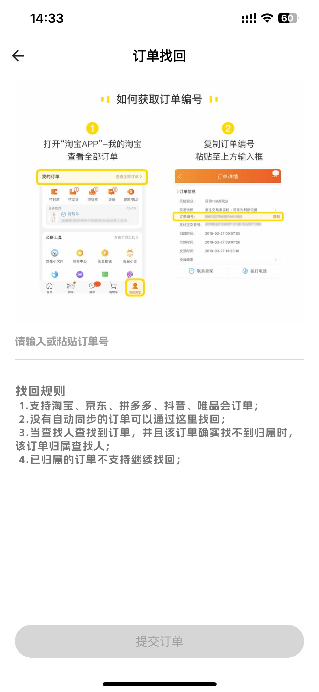
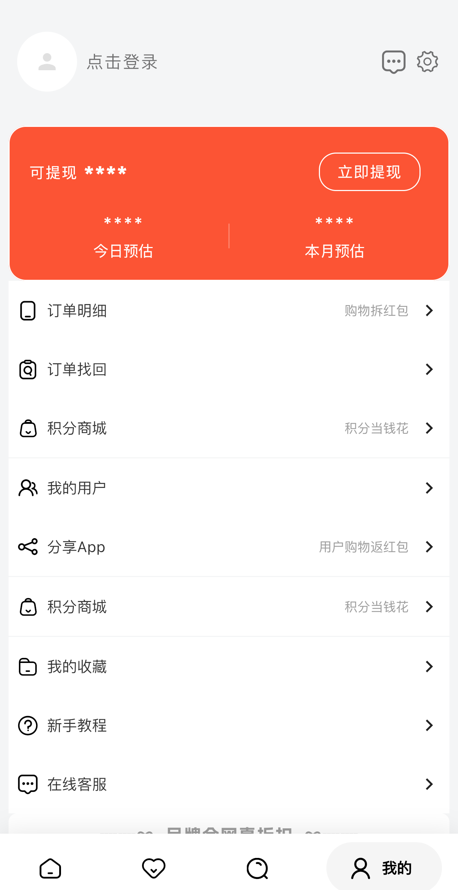
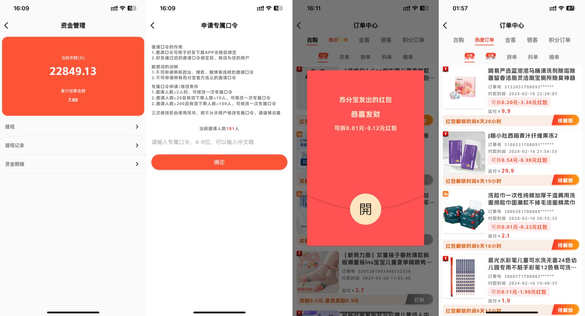

# 天天淘开源淘宝客APP系统

---

### 📖 简介：

天天淘开源淘宝客APP系统，基于Java（SpringBoot）+Vue+Flutter开发。APP端代码全开源无加密，二开很方便，还支持免费商用，能满足企业淘宝客APP等经营需求，自用、做二开项目都很合适。

---

### ⭐️ 系统功能

|  | 功能     | 描述                                                            |
|--|--------|---------------------------------------------------------------|
| 🚀 | 登录     | 手机号一键登录、微信登录、手机验证码登录、苹果Apple Id                               |
|  | 退出登录   | 退出当前用户登录状态                                                    |
|  | 注销用户   | 注销当前账号                                                        |
|  | 头像设置   | 可以使用相册修改头像                                                    |
|  | 昵称设置   | 修改自定义昵称，支持emoj表情                                              |
|  | 绑定口令   | 绑定邀请用户的口令                                                     |
| 🚀 | 申请专属口令 | 完成任务可以修改自身口令，支持中文                                             |
| 🚀 | 实名认证   | 支持身份证识别、支付宝人脸认证和合同自动签署                                        |
| 🚀 | 微信授权   | 绑定微信，实现提现自动到微信零钱、微信登录                                         |
| 🚀 | 支付宝授权  | 当前账号绑定支付宝，实现提现自动到支付宝                                          |
| 🚀 | 地址管理   | 可以设置邮寄地址，用于积分商城邮寄商品                                           |
| 🚀 | 积分商城   | 设置换购商品，购物获得积分后，可在积分商城兑换                                       |
| 🚀 | 吐槽我们   | 用户反馈建议                                                        |
|  | 隐私政策   | 支持查看用户协议、隐私政策、个人信息收集清单、个人信息共享清单等页面                            |
|  | 消息推送   | 支持订单消息推送                                                      |
| 🚀 | 收益预估   | 支持查看预估收入和订单数量，查看维度：今日、近7日、本月、上月，总览、自购、好友预估、已结算等               |
| 🚀 | 提现     | 支持微信和支付宝提现，自动到账，支持每天可提现次数、最低提现金额设置，资金明细查看，提现记录和状态查看           |
| 🚀 | 商品展示   | 支持淘宝、京东、拼多多、抖音（暂时下线）、抖音团购、美团外卖、饿了么和唯品会商品展示                    |
| 🚀 | 商品搜索   | 支持淘宝、京东、拼多多、抖音和唯品会商品搜索，关键字搜索，联想搜索，搜索历史保存，搜索结果综合、销量和价格排序       |
| 🚀 | 商品分享   | 支持淘宝、京东、拼多多、抖音和唯品会商品海报分享，部分支持口令                               |
| 🚀 | 购物返红包  | 订单打开红包获得返利                                                    |
| 🚀 | 识别查券   | 支持复制链接、口令等到app查询优惠券，支持淘宝、京东、拼多多、唯品会                           |
| 🚀 | 订单明细   | 查看自购、好友（支持订单隐私设置）、积分兑换订单，查看淘宝、京东、拼多多、抖音、唯品会、美团的订单             |
| 🚀 | 订单找回   | 系统遗漏没有自动绑定到用户的订单，用户可以手动绑定                            |
| 🚀 | 我的好友   | 可以查看邀请的一二级好友，并显示最近登录时间，本月预估和好友数量                              |
| 🚀 | 分享App  | 支持海报设置，轮播展示，自动生成邀请二维码，支持微信分享app、分享链接、分享海报                     |
| 🚀 | 商品收藏   | 支持商品收藏和展示并跳转购买                                                |
| 🚀 | 新手教程   | app使用教程                                                       |
| 🚀 | 在线客服   | 对接企业微信客服，方便用户咨询                                               |
| 🚀 | 会员付费   | 支持微信、支付宝、苹果内购、易宝、银盛等支付开通app会员，支持在app内使用网页支付、app支付、绑卡支付、 收银台支付 |
| 🚀 | 消息中心   | 查看用户消息、收益消息、订单消息等                                             |

### 💡 系统亮点：
>1.【服务端】SpringBoot 框架开发业界主流 
>2.【管理端】Vue + Element UI 
>3.【APP端】移动端使用 Flutter 框架,多端支持，原生体验 

---

### 💻 运行环境及框架：
~~~
1.移动端Flutter开发框架
2.WEB PC 管理后台使用Vue + Element UI 开发
3.后台服务 Java SpringBoot + Mybatis-plus + Mysql + redis
4.运行环境 linux, 需要Java环境和对应的数据库 redis
5.运行条件 Java 1.8 Mysql5.7
6.移动端调试环境 AndroidStudio Flutter3.24.3 Dart3.5.3
~~~
---

### 🎬 系统演示
[演示后台（查看）](https://docs-sfb.mailvor.com/docs/demo/demo.html)

---

### 💟 UI界面

#### 📱 移动端预览

---

### 🔧 Java项目框架 和 WEB PC 项目运行环境
~~~
1. SpringBoot 2.6.7.RELEASE
2. Maven 3.8.1
3. swagger-bootstrap-ui 1.0
4. Mybatis Plus 3.5.1
5. npm 6
6. node 14
7. vue 2.x
8. element ui 2.13
9. Flutter3.24.3
10.Dart3.5.3
~~~

---

